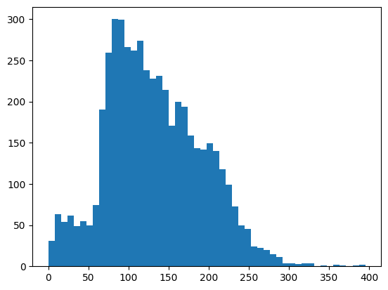

# Galactic


<p align="center">
    <a href="https://galactic-ai.slack.com/">
        
    </a>
        <a href="https://trytaylor.ai/">
        
    </a>
    <a href="https://github.com/taylorai/galactic/blob/main/LICENSE">
          
    </a>
        <a href="https://galactic-ai.readthedocs.io/en/latest">
          
    </a>
    <br/>
    <a href="https://github.com/taylorai/galactic">
    
    </a>
    <a href="https://twitter.com/intent/follow?screen_name=TryTaylor_AI">
        
    </a>
</p>

Galactic provides cleaning and curation tools for massive unstructured text datasets. It's designed to help you curate fine-tuning datasets, create document collections for retrieval-augmented generation (RAG), and even perform deduplication of web-scale datasets for LLM pre-training. This README provides a non-exhaustive overview of what Galactic can do; for more details, check out the [API reference](https://github.com/taylorai/galactic/blob/main/API_REFERENCE.md).

Galactic is made available under the Apache 2.0 license.

## Getting Started
To get started, install the package (`pip install galactic-ai`) and import it:

```python
from galactic import GalacticDataset
```

Galactic supports familiar generic methods for data processing that you'll be familiar with if you've ever used HuggingFace datasets, like `map`, `filter`, `select`. Galactic also provides a higher-level API for common workflows in text data curation, such as computing embeddings, language detection, scrubbing PII, labeling columns with AI, and large-scale deduplication. Let's dive in!

## ✨ NEW! (v0.2.4) AI data labeling & classifier distillation ✨
Galactic now supports using AI to augment and enrich your datasets. Classify a text column into fixed categories with `ai_classifier`, do open-ended processing like cleaning or summarization with `ai_column`, or tag multiple attributes with `ai_tagger`. When you hit your budget for sending API calls to OpenAI and still want to go bigger, train a `fasttext_classifier` or `embeddings_classifier` to distill your AI- or human-written labels into a fast classifier without leaving your notebook.

See the [OpenHermes](https://github.com/taylorai/galactic/blob/main/examples/hermes.ipynb) example notebook for a full demonstration, where we use OpenAI to label a few thousand examples, distill a speedy classifier, and then use that classifier to label 100k+ examples in 1 minute. All the AI labeling and distillation methods are documented in the [API reference](https://github.com/taylorai/galactic/blob/main/API_REFERENCE.md) as well.

## Loading Data

Galactic can load datasets from typical file formats (CSV, JSONL, Parquet), as well as from HuggingFace. If you're loading a massive dataset from HuggingFace, you can even filter data as it streams in, ensuring you don't load any duplicates, and you only hang on to data you want. For instance, here we will load the Falcon RefinedWeb dataset, but automatically deduplicate it, and only keep examples with fewer than 1024 characters. Let's get 5000 samples that meet our requirements.

```python
filter_func = lambda x: len(x['content']) < 1024
dataset = GalacticDataset.from_hugging_face_stream(
    "tiiuae/falcon-refinedweb",
    split="train",
    filters=[filter_func],
    dedup_fields=["content"],
    max_samples=5000
)
```


## Understanding the Data
Galactic is designed to help you understand unstructured text datasets. Let's start with some basics: we'll get the lengths of the texts using our tokenizer of choice, detect the language of the text, and scan for PII.


```python
import matplotlib.pyplot as plt
dataset = dataset.count_tokens(fields=["content"], tokenizer="gpt2")
plt.hist(dataset["__token_count__content"], bins=50);
```
    

    

```python
from collections import Counter
dataset.detect_language(field="content")
Counter(dataset["__language"])
```
    INFO: Detected language in field content, added language metadata to '__language'.

    Counter({'en': 4975,
             'es': 7,
             'fr': 7,
             'de': 3,
             'da': 2,
             'ru': 1,
             'nl': 1,
             'pt': 1,
             'sh': 1,
             'eo': 1,
             'ceb': 1})

```python
dataset.detect_pii(
    fields=["content"]
)
print("Email:", sum(dataset["__pii__email"]))
print("Phone:", sum(dataset["__pii__phone"]))
print("Username/Password:", sum(dataset["__pii__credential"]))
```

    INFO: Detected PII in fields: ['content']; added __pii__email, __pii__phone, __pii__credential, and __pii__any metadata.


    Email: 285
    Phone: 242
    Username/Password: 9


## Custom Tagging & Filtering
The built-in functions are just to get you started--Galactic allows you to tag and filter your data however you want. For instance, here we'll do the following:
* Filter out all examples that have "blogspot" in the URL.
* Tag all examples that mention fruit or vegetables.


```python
dataset = dataset.filter_string(
    fields=["url"],
    values=["blogspot"]
)
len(dataset)
```

    INFO: Filtered dataset in-place with exact string matching on fields: ['url']

    4902

```python
dataset = dataset.tag_regex(
    fields=["content"],
    regex="fruit|Fruit|vegetable|Vegetable|veggie|Veggie",
    tag="fruit_veggie"
)
f'{sum(dataset["__tag__fruit_veggie"])} records tagged with __tag__fruit_veggie'

```

    INFO: Tagged dataset in-place with tag '__tag__fruit_veggie', using regex matching on fields: ['content']

    '38 records tagged with __tag__fruit_veggie'


## Embeddings & Clustering

Text embeddings are a great way to explore and understand unstructured data. Galactic can compute embeddings right on your CPU with the `gte-small` model, and then use them to cluster and deduplicate your data. (You also have the option to use OpenAI API embeddings as the backend--they're faster, but each embedding is larger, and you have to provide an API key.) On my Intel Macbook (no fancy M1 or M2), I can compute 1000 embeddings in a couple minutes. Longer texts also take longer since they have to be chunked into 512-token segments.


```python
# to use openai, set dataset.openai_api_key = [...], and use backend="openai"
dataset.get_embeddings(field="content", backend="cpu")
```

    INFO: Created embeddings on field 'content'

Once we've computed embeddings for a dataset, we can cluster it with k-means. Clusters can help discover domains in the data, or subsets that we might want to remove. They can also be used downstream for intra-cluster semantic deduplication (i.e. removing examples that share a cluster and are very close by in the embedding space).


```python
dataset.cluster(n_clusters=10)
dataset.get_cluster_info(field="content")
```


    Cluster 0 (550 items)
    Cluster 1 (549 items)
    Cluster 2 (673 items)
    Cluster 3 (468 items)
    Cluster 4 (403 items)
    Cluster 5 (592 items)
    Cluster 6 (290 items)
    Cluster 7 (616 items)
    Cluster 8 (461 items)
    Cluster 9 (300 items)

Semantic deduplication within clusters is carried out with `semdedup` (inspired by [this paper](https://arxiv.org/abs/2303.09540)). You can provide a target retention rate for what percent of data you want to keep (the threshold will be tuned to achieve roughly this rate), or you can provide a cosine similarity threshold, and pairs within a cluster whose similarity is above the threshold will be considered duplicates.


```python
dataset.semdedup(target_retention=0.75)
```

    INFO: Tuning threshold on 3 clusters...
    INFO: Threshold: 0.92
    INFO: Cluster 0 has 106 duplicates (19.3%).
    INFO: Cluster 1 has 133 duplicates (24.2%).
    INFO: Cluster 2 has 489 duplicates (72.7%).
    INFO: Cluster 3 has 125 duplicates (26.7%).
    INFO: Cluster 4 has 96 duplicates (23.8%).
    INFO: Cluster 5 has 354 duplicates (59.8%).
    INFO: Cluster 6 has 80 duplicates (27.6%).
    INFO: Cluster 7 has 96 duplicates (15.6%).
    INFO: Cluster 8 has 174 duplicates (37.7%).
    INFO: Cluster 9 has 25 duplicates (8.3%).
    INFO: Removed 1678 / 4902 items flagged as semantic near-duplicates (34.23%).

## Saving the result

Finally, let's save this data--either for more Galactic goodness later on (who wants to compute those embeddings again?), or so we can use it downstream for retrieval or fine-tuning.

```python
dataset.save("my_dataset.jsonl")
```

## What's Next?
This first release is just a taste of what we have planned for Galactic. Here's what you have to look forward to:
* __AI Data Labeling:__ Use API language models like OpenAI, or small local models, to automatically tag or filter your data for you. We'll also provide more fast classifiers (as with language identification) to do things like flag SEO spam, or detect if a sample is text vs. source code.
* __More Powerful Deduplication:__ We will add Minhash-LSH to remove near-duplicates before you even have to compute embeddings. We will also add support for [D4](https://arxiv.org/abs/2308.12284), which follows semantic deduplication with a "diversification" step, keeping data that's further from cluster centroids.
* __Scaling:__ The features we've built so far can handle thousands or even hundreds of thousands of examples without breaking a sweat, but for true web-scale data processing, local embeddings start to feel slow, and memory becomes precious. We're working on features (like smaller, faster embeddings) to allow Galactic to scale gracefully to millions of examples.

If you like what we're doing, throw us a star on GitHub (or even better, contribute!), and stay tuned for more.